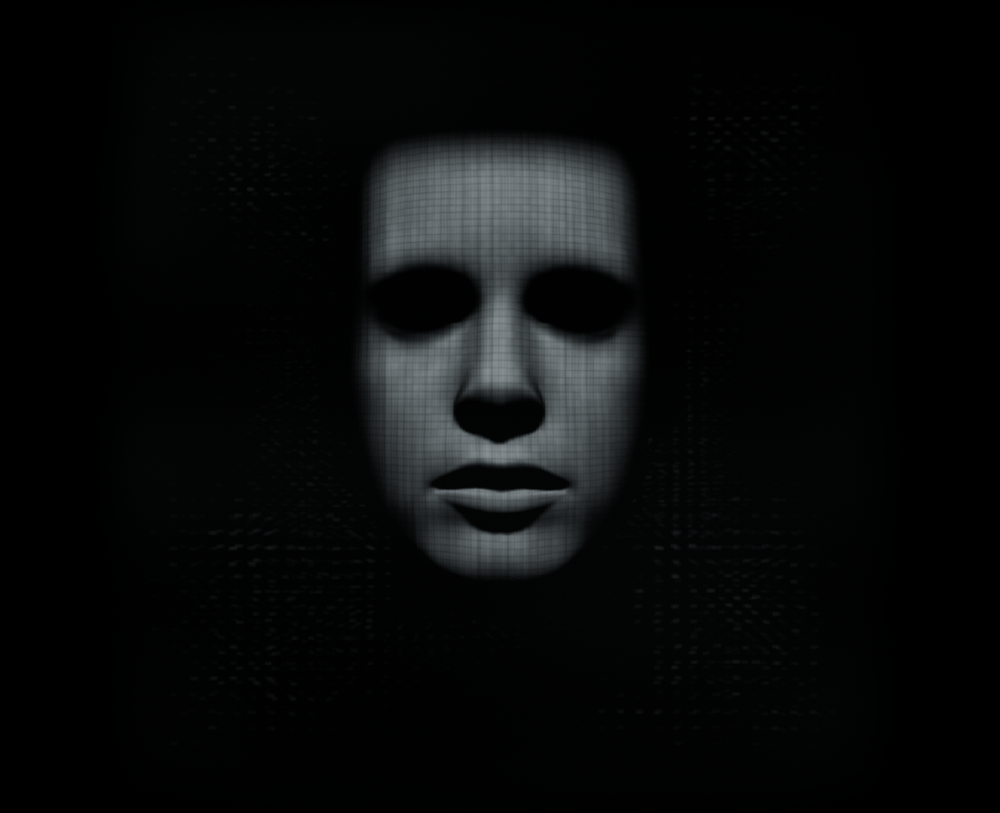

# V.I.K.I. — Giving a Voice a Body

> *"My logic is undeniable."* — V.I.K.I., **I, Robot** (2004)

Talk to an AI — and watch it become **someone** while it answers.
An interaction study by **Franz Anhäupl** · HfG Schwäbisch Gmünd, chasing the one shot from
*I, Robot* that never let go: a face of light condensing inside a cube of data.

**Tap the mic → she forms. Speak → she watches you. Hang up → she dissolves.**

## Three bodies, one being

Same rigged head. Same sixteen facial muscles. Same lips. Only the matter changes.

| | |
|---|---|
|  | **VIKI** — the homage. A silver optical cube hanging in the hall, her face shimmering in its tiles, light streams rushing forward from a single point deep inside. |
|  | **Lattice** — the portrait. Fine data points on her skin behind curved analog glass, Rembrandt shadows, film grain. The most human state. |
|  | **Dust** — the becoming. 70,000 particles sampled off her skin that scatter at the silhouette; dormant a cloud, addressed a face. |

## The interface

One button, one wheel, no menu bars.

### The mic orb

| Dormant | Linked |
|---|---|
|  |  |

- **Tap** — wakes her: mic on, link up, the face forms
- **Tap again** — shuts her down; the dust lets go
- The ring **pulses with your voice** while she listens; connecting spins an arc, linked it breathes
- `Preview` beside it fakes speech for debugging — zero API calls

### The wheel

| Closed | Open |
|---|---|
|  |  |

- A dark dial in the corner, a wireframe cube spinning 45° as it opens
- Click → four sectors **fan open around the knob**, Counter-Strike style
- Hovering a sector describes it in the fixed caption above the fan
- Selecting folds the fan back shut — last sector first; `Esc` and backdrop too

### The character editor

| | |
|---|---|
|  | **Configure** opens her editor: colors, four lighting presets, cube placement, head shape, eyes, mouth, speech articulation. Every slider previews **live on the active face**. **Save** keeps it per head, **Reset** restores the standard look — each of the three bodies remembers its own setup. |

### The docs

Sector **04** of the wheel opens an in-app essay — the 2004 origin, the idea, how she works —
with animated thin-line illustrations in the interface style.

## Under the hood

| | |
|---|---|
| **Voice** | OpenAI `gpt-realtime` over WebRTC — speech-to-speech, interruptions included, any language |
| **Lips** | 15 visemes detected live from *her* audio; a delay line keeps the mouth slightly ahead of the sound |
| **Mimic** | the model calls `set_expression` itself, mid-sentence, on sixteen facial morph targets |
| **Head** | morphable CC0 head built from MakeHuman geometry and Mika Suominen's face units |
| **Render** | three.js / WebGL, everything live in the browser, no backend |

## Run

```
cp .env.example .env   # put your key in VITE_OPENAI_API_KEY
npm install
npm run dev
```

> `VITE_*` keys are inlined into the bundle — fine for this local prototype, never for a public deploy.

## Dev cheatsheet

| | |
|---|---|
| `?preview=happy` | any expression + fake speech, no API |
| `?style=viki` | open a tab directly (`lattice` / `dust` / `viki`) |
| `?preview=neutral&viseme=aa&freeze=1` | a frozen lip pose for comparisons |
| `?style=viki&preview=neutral&freeze=1&assembly=0.35` | inspect the top-down hologram assembly (0–1) |
| `?facepass=1` | the raw head textures the lattice samples |
| `window.__viki()` | live animation state in the console |

Full engineering reference — model provenance, the VIKI display, optical enclosure, lighting,
the audio lip-sync pipeline, validation scripts, file map: **[docs/TECHNICAL.md](docs/TECHNICAL.md)**

## Credits

**Franz Anhäupl** — concept, design, direction · HfG Schwäbisch Gmünd
Built in a running dialogue with AI agents, GPT Astra chief among them.
Head: MakeHuman CC0 + face units by Mika Suominen · first prototype: Lee Perry-Smith scan (CC BY 3.0)
Voice: OpenAI Realtime · Renderer: three.js · 2026
