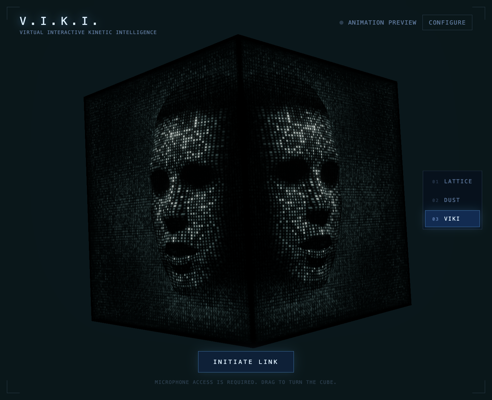
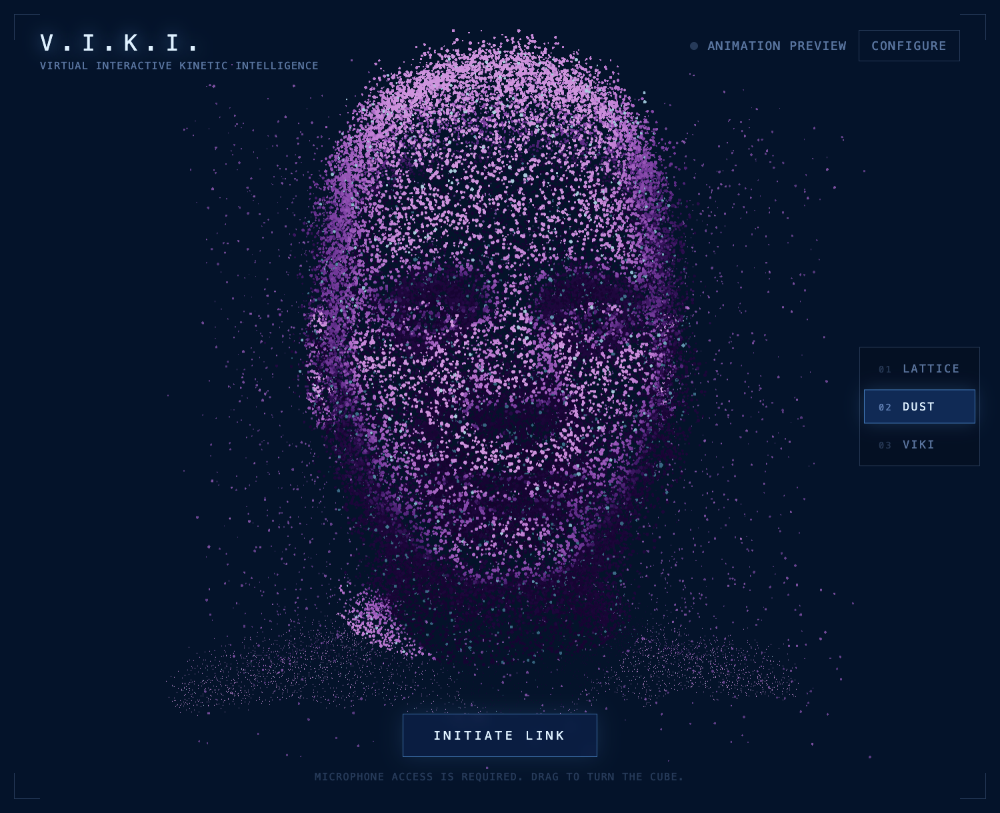
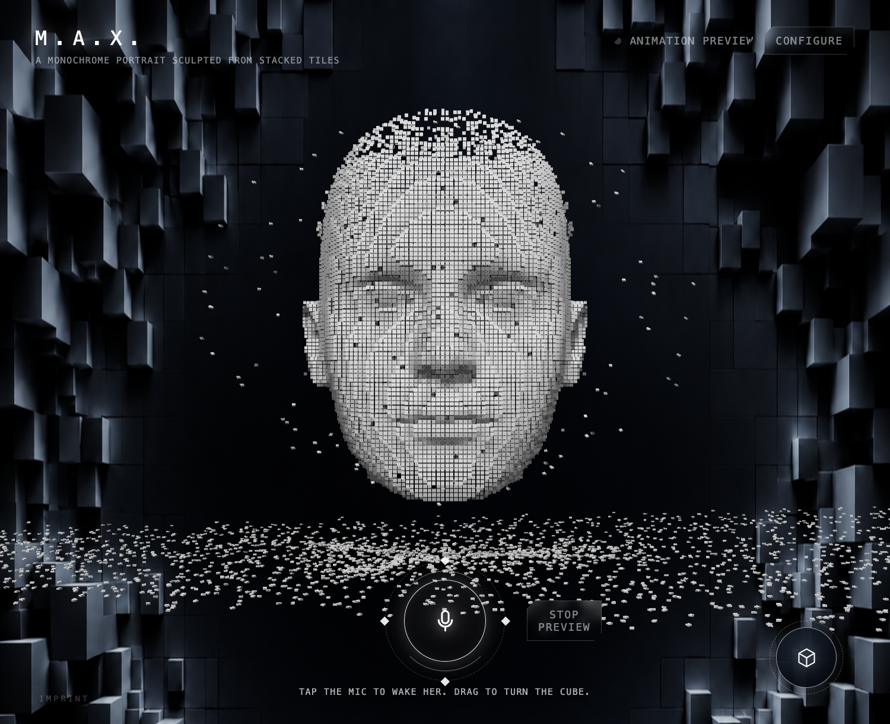
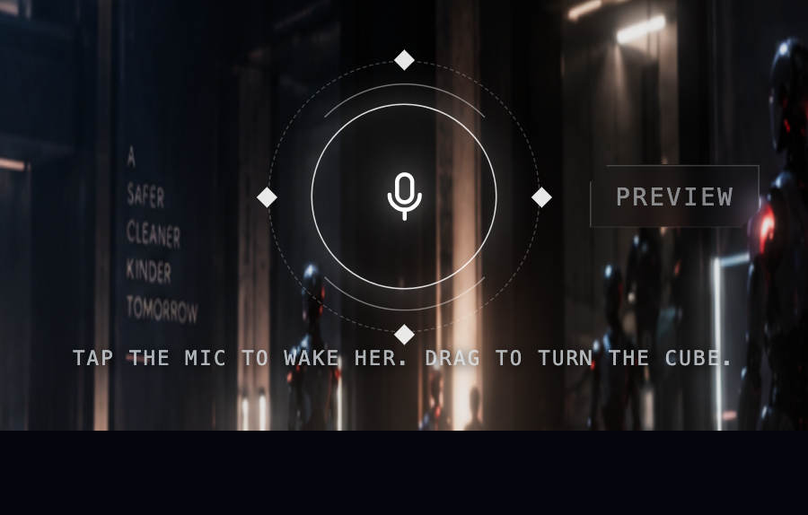
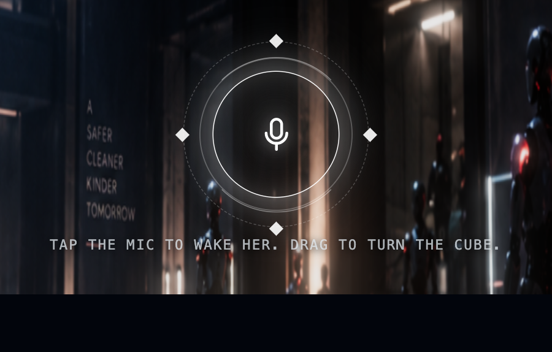
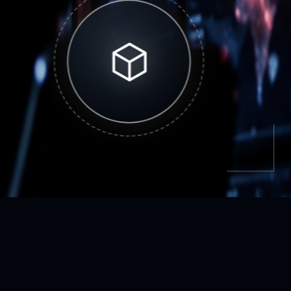
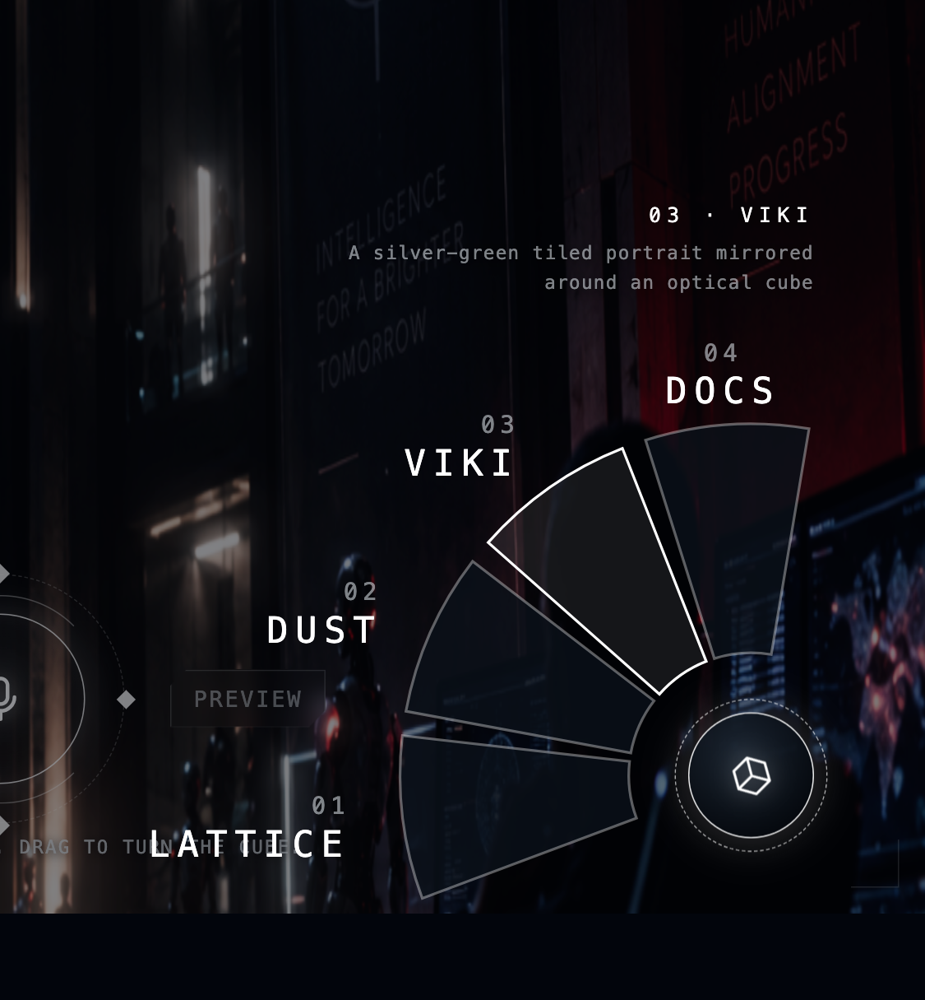
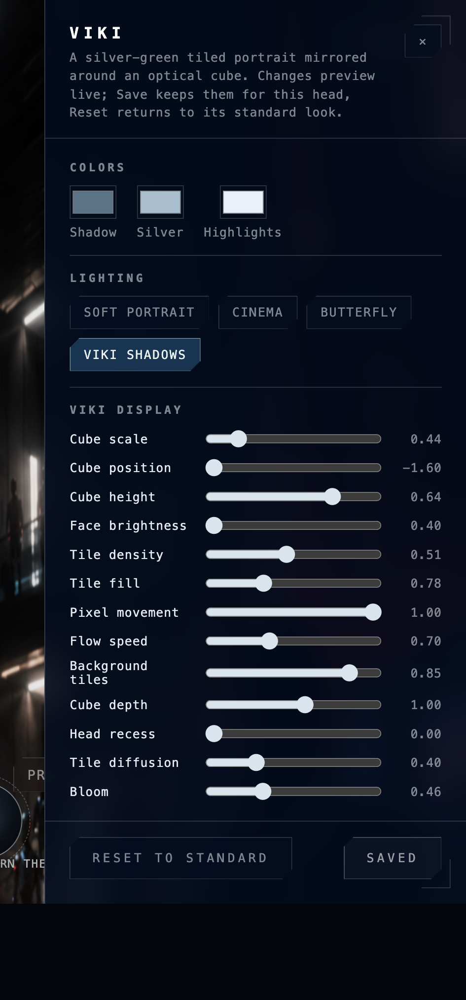

# V.I.K.I. — Giving a Voice a Body

> *"My logic is undeniable."* — V.I.K.I., **I, Robot** (2004)

Talk to an AI — and watch it become **someone** while it answers.
An interaction study by **Franz Anhäupl** · HfG Schwäbisch Gmünd, chasing the one shot from
*I, Robot* that never let go: a face of light condensing inside a cube of data.

**Tap the mic → she forms. Speak → she watches you. Hang up → she dissolves.**

## Three bodies, three characters

Same rigged head. Same sixteen facial muscles. Same lips. Only the matter changes — and with it, who she is.

| | |
|---|---|
|  | **V.I.K.I.** — the homage. A silver optical cube hanging in the hall, her face shimmering across its tiles, built top-down in raining matrix strands. **Character:** the film's VIKI — calm, coldly logical, faintly ominous. *"Hello, Detective."* |
|  | **D.U.S.T.** — the becoming. Tens of thousands of particles that lean towards a face while you speak and fray into noise at her silhouette. **Character:** deeply warm and friendly — held together, quite literally, by your attention. |
|  | **M.A.X.** — the matter. Physical tiles with real GPU gravity: they lie on the floor, levitate when the voice calls, assemble into a monochrome sculpture — and what he doesn't need rains back down, bounces and rests. **Character:** very funny. He *did* just pull himself together for you. |
## The interface

One button, one wheel, no menu bars.

### The mic orb

| Dormant | Linked |
|---|---|
|  |  |

- **Tap** — wakes her: mic on, link up, the face forms
- **Tap again** — shuts her down; the dust lets go
- The ring **pulses with your voice** while she listens; connecting spins an arc, linked it breathes
- `Preview` beside it fakes speech for debugging — zero API calls

### The wheel

| Closed | Open |
|---|---|
|  |  |

- A dark dial in the corner, a wireframe cube spinning 45° as it opens
- Click → four sectors **fan open around the knob**, Counter-Strike style: VIKI, Dust, Max, Docs
- Hovering a sector describes it in the fixed caption above the fan
- Selecting folds the fan back shut — last sector first; `Esc` and backdrop too

### The character editor

| | |
|---|---|
|  | **Configure** opens her editor: colors, four lighting presets, cube placement, head shape, eyes, mouth, speech articulation. Every slider previews **live on the active face**. **Save** keeps it per head, **Reset** restores the standard look — each of the three bodies remembers its own setup. |

### The docs

Sector **04** of the wheel opens an in-app essay — the 2004 origin, the idea, how she works —
with animated thin-line illustrations in the interface style.

## Under the hood

| | |
|---|---|
| **Voice** | AssemblyAI **Voice Agent API** over one WebSocket — Universal streaming speech-to-text, a managed LLM and text-to-speech, semantic turn-taking and barge-in, 18 input languages |
| **Lips** | 15 visemes detected live from *her* audio; a delay line keeps the mouth slightly ahead of the sound |
| **Mimic** | the model opens every reply with a silent expression tag — `[[curious]]`, `[[stern]]`… — that the TTS never speaks; it reaches the face through the word stream as her first word starts, on sixteen facial morph targets |
| **Character** | each head carries its own persona and greeting — cold logic, warmth, jokes — swapped live when you switch heads |
| **Head** | morphable CC0 head built from MakeHuman geometry and Mika Suominen's face units |
| **Render** | three.js / WebGL, everything live in the browser; the only backend is one tiny token endpoint that keeps the API key off the client |

## Run

```
cp .env.example .env   # put your AssemblyAI key in ASSEMBLYAI_API_KEY
npm install
npm run dev
```

> To try it from a phone or another machine, run `npm run dev:https` instead: microphones need a secure origin,
> and the self-signed certificate only has to be accepted once in that browser.

> The key never reaches the browser: the dev server (and, on Vercel, `api/token.js`) mints single-use
> Voice Agent tokens for each conversation. Without a key everything still runs in preview mode.

### Deploy

Set `ASSEMBLYAI_API_KEY` in the Vercel project settings (no `VITE_` prefix). `api/token.js` becomes a
serverless function; the same handler runs inside `npm run dev` locally.

### Docs at hand

`.mcp.json` registers AssemblyAI's documentation MCP server, so Claude Code can answer Voice Agent and
LLM Gateway questions from the live docs while you work — approve it on the first launch.

### Duet

Two heads, two tabs, one room: open one head with `?duet=start&partner=max` and the other with
`?duet=wait&partner=viki`; add `&topic=philosophy` or `&topic=skynet` for the staged scenes.

## Dev cheatsheet

| | |
|---|---|
| `?preview=happy` | any expression + fake speech, no API |
| `?style=viki` | open a head directly (`viki` / `dust` / `lattice` — the last one is Max) |
| `?preview=neutral&viseme=aa&freeze=1` | a frozen lip pose for comparisons |
| `?style=viki&preview=neutral&freeze=1&assembly=0.35` | inspect the top-down hologram assembly (0–1) |
| `?facepass=1` | the raw head textures the lattice samples |
| `window.__viki()` | live animation state in the console |

Full engineering reference — model provenance, the VIKI display, optical enclosure, lighting,
the audio lip-sync pipeline, validation scripts, file map: **[docs/TECHNICAL.md](docs/TECHNICAL.md)**

## Credits

**Franz Anhäupl** — concept, design, direction · HfG Schwäbisch Gmünd
Built in a running dialogue with AI agents, GPT Astra chief among them.
Head: MakeHuman CC0 + face units by Mika Suominen · first prototype: Lee Perry-Smith scan (CC BY 3.0)
Voice: AssemblyAI Voice Agent API · Renderer: three.js · 2026
